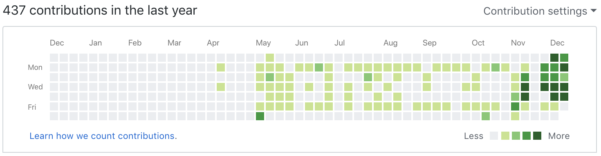
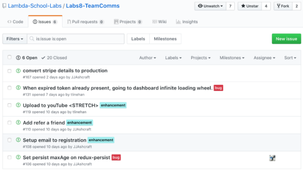
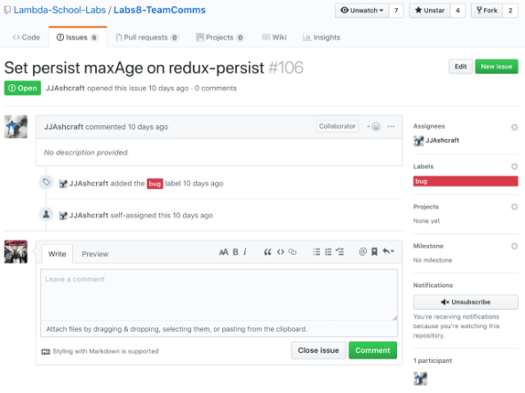
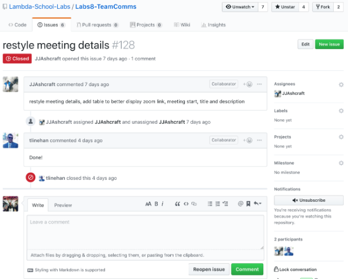

## Summary
This week was our final week however we didn't get the whole week to work on the project. Monday was a final bug fix and feature adjustment day and then Tuesday was our Capstone Defense. This is what we were all preparing for. It is an hour presentation where our team presents our app we created and then are broken into solo interviews in separate breakout sessions. One was with a computer science instructor and the second was with a full stack web instructor. I was very nervous for this since it was my first time doing anything like this but it went incredibly well and I was satisfied.

# Part 1 - Individual Accomplishments this Week
Github Handle: Jameson13B

## Tasks Pulled

### Front End/Issue Fixes
* Ticket 1 - Added cursor pointer to big add button
  * [Github](https://github.com/Lambda-School-Labs/Labs8-TeamComms/pull/124)
  * [Trello](https://trello.com/c/vS7jez3o)
* Ticket 2 - Logo ternary redirect
  * [Github](https://github.com/Lambda-School-Labs/Labs8-TeamComms/pull/125)
  * [Trello](https://trello.com/c/Vk2PlrZd)
* Ticket 3 - Fixing calendar on create and update
  * [Github](https://github.com/Lambda-School-Labs/Labs8-TeamComms/pull/130)
  * [Trello](Link)
* Ticket 4 - Delete confirmation modal
  * [Github](https://github.com/Lambda-School-Labs/Labs8-TeamComms/pull/134)
  * [Trello](Link)
* Ticket 5 - Stripe Alignment Fix
  * [Github](https://github.com/Lambda-School-Labs/Labs8-TeamComms/pull/136)
  * [Trello](Link)
* Ticket 6 - Teal add icon
  * [Github](https://github.com/Lambda-School-Labs/Labs8-TeamComms/pull/145)
  * [Trello](Link)
* Ticket 7 - Fixed hover transition
  * [Github](https://github.com/Lambda-School-Labs/Labs8-TeamComms/pull/148)
  * [Trello](Link)
* Ticket 8 - Code clean up
  * [Github](https://github.com/Lambda-School-Labs/Labs8-TeamComms/pull/155)
  * [Trello](Link)
* Ticket 8 - Fixed create route
  * [Github](https://github.com/Lambda-School-Labs/Labs8-TeamComms/pull/158)
  * [Trello](Link)
* Ticket 8 - Mobile menu layout
  * [Github](https://github.com/Lambda-School-Labs/Labs8-TeamComms/pull/159)
  * [Trello](Link)

## Detailed Analysis
Due to the nature of this week and how most of the tickets were small fixes or adjustments and not enough for a full analysis, I am going to be discussing polish and issue tickets as a whole.

One of the features built into GitHub is the Issues tracker. It is a system theat enables teams to log, assign, and track issues from their project/website. It has many features from assigning the ticket to users, assiging labels(bug, enhancement, 
good first issue, etc.), and more.

> Screenshot of Issues tracker on GitHub
> 

As you can see above the main tracker screen displays tickets. There are a good amount of options to filter with including open/closed, author, labels, etc. On the right side of each ticket is the user that has been assigned to fix that issue. The issue details screen can be accessed by clicking on a specific issue.

> Issue details screen
> 

This screen shows all the details about the issue. Description, when it was created and by who, it has a log of changes to the issue and also allows for comments to collaborate. Once the issue is fixed it can be closed which will remove it from the default list view and only show when you filter for closed issues.

> Screenshot of close issue
> 

Last screenshot above is what a closed ticket looks like. Some include more notes and info, some include less. As long as the tracker is making your job easier and not harder to me it is worth using. Tools that make our job easier, smoother, or just better we should seriously consider.

# Part 2 - Milestone Reflections
This last week was about making sure everything looked perfect and functionality worked successfully. There was a ton of just trying many different things on our website with different variables(logged in/out, no meetings/many meetings, etc) and when we found issues or bugs we recorded them on the issue tracker. This was very helpful and really helped us iron out the kinks in our project and make sure it was ready for capstone defense and for our demo video recording. I talked about the issue tracker above so I dont want to repeat a ton. Instead I want to talk about a last minute stretch that was squeezed in this week.  While JJ and myself we focusing on resolving tickets and finding any other issues we could, Austin was working on making the web sockets for the live colab note taking section so it was smooth and would opperate with no flaws.  This left Tristan who took upon the large task of bringing in the Zoom API to allow users to create a custom zoom URL for a zoom meeting at that date and time in the future.  That link is then available to all participants of the meeting to join when the time is right. This was a stretch but a great one to add and Tristan did a great job researching that API.

## Tech Stack:
* M - MongoDB
* E - Express
* R - React/Redux
* N - Node
* Styled Components
* Zoom, Stripe, and Socket.io

## App Description:
* Team Communicator is an open-source web app that keeps remote teams in sync. This app uses the Zoom API to generate meetings, optional Google OAuth integration, websocket functionality for real-time document collaboration and much more. We are currently working to add automatic Youtube uploading and fuzzy video search.

## Media Licenses:
Site Media on [Github](https://github.com/Lambda-School-Labs/Labs8-TeamComms/tree/master/public/images)
* Licenses for all media on site have been tracked. This info is currently being compiled and will be added in the next couple weeks. This is something we have been aware of since the beginning and my teammate JJ did a great job at keeping track of this info.

