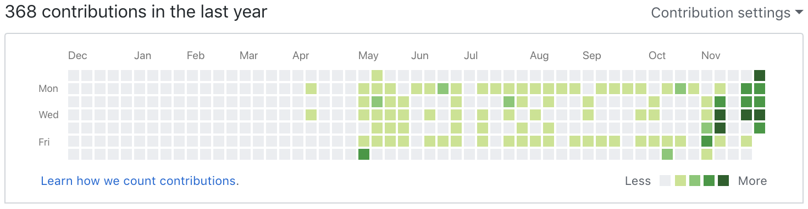
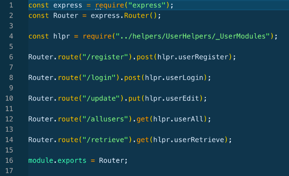
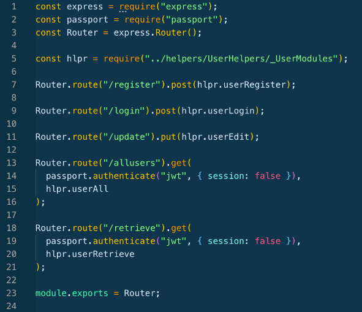
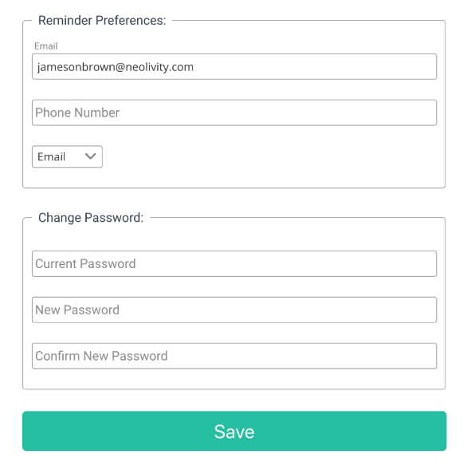

## Summary
This week was all about polishing up our application. We spent the first couple days working out bugs with our existing functionality. Then spent the rest of the time working on styling, spacing, layout, etc. This was a really tough week with a ton of tiny changes and so many of them. Also, at this point a lot of our components are connected and the backend involved with many, so we were working around making changes wihtout causing merge conflicts with other teammates changes. It was a good challenge and we were successful for the most part. I was just able to get some experience working on merge conflicts which was beneficial.

# Part 1 - Individual Accomplishments this Week
Github Handle: Jameson13B

## Tasks Pulled

### Total - 8

### Front End
* Ticket 1 - Update Meeting Component
  * [Github](https://github.com/Lambda-School-Labs/Labs8-TeamComms/pull/74)
  * [Trello](https://trello.com/c/dgzA7Eh3)
* Ticket 2 - Edit Meeting Connect Server
  * [Github](https://github.com/Lambda-School-Labs/Labs8-TeamComms/pull/75)
  * [Trello](https://trello.com/c/ReUWqXtG)
* Ticket 3 - Fixing Spacing on Forms
  * [Github](https://github.com/Lambda-School-Labs/Labs8-TeamComms/pull/87)
  * [Trello](https://trello.com/c/kehOsUqe)
* Ticket 4 - Stripe Fixes
  * [Github](https://github.com/Lambda-School-Labs/Labs8-TeamComms/pull/92)
  * [Trello](https://trello.com/c/LlbocA7G)
* Ticket 5 - Preferences Connect Client to Server(Back End Also)
  * [Github](https://github.com/Lambda-School-Labs/Labs8-TeamComms/pull/94)
  * [Trello](https://trello.com/c/8ii1xOoe)
* Ticket 6 - Preference Button and Layout
  * [Github](https://github.com/Lambda-School-Labs/Labs8-TeamComms/pull/99)
  * [Trello](https://trello.com/c/2G6B0hht)
* Ticket 7 - Display Bug Fixes
  * [Github](https://github.com/Lambda-School-Labs/Labs8-TeamComms/pull/103)
  * [Trello](https://trello.com/c/sC0UBOvr)

### Back End
* Ticket 1 - Update Meeting Endpoint
  * [Github](https://github.com/Lambda-School-Labs/Labs8-TeamComms/pull/77)
  * [Trello](https://trello.com/c/dgzA7Eh3)
* Ticket 2 - Preferences Connect Client to Server(Front End Also)
  * [Github](https://github.com/Lambda-School-Labs/Labs8-TeamComms/pull/94)
  * [Trello](https://trello.com/c/8ii1xOoe)

## Detailed Analysis
The ticket I am choosing for my detailed analysis this week is *Preferences Connect Client to Server*. This ticket involved the work on the client(front end) and the server(back end). Back in week two Austin built a user update endpoint with the UserModel at the time. As our project has evolved over the past two weeks the model has changed quite a bit and that existing endpoint needed a decent amount of rebuilding. We also needed to protect this endpoint to users only, which is what I wanted to talk about first.
  

We used a middleware called [Passport JS](http://www.passportjs.org/). Passport can be used in any Express web application and supports authentication using username and password, Facebook, Twitter, Google, and so many more strategies. We used it with our username and password login as well as Google OAuth. To tie this into the Analysis, we use this same middleware to protect user private endpoints. The following code shows a before and after the middleware is applied.

> Before Passport Middleware  
> 

> After Passport Middlware  
> 

Moving on to the Client, Back in week two I created a basic User Preferences component, created a commented out axios call, and populated the form with dummy data. So I started by simply removing the dummy data and uncommenting the axios call. Since we are trying to hit a protected endpoint I set up the headers of the request with the axios token that our new middleware will check. Before hitting the request I set up a check to see if A) The user was changing their password or not, and B) If they were, did the new password and confirm new password match. After that it was just passing in the edited data in the body of the request and that was it. See the picture below for a screenshot from our User Preferences page.

> User Preferences screen shot from the application  
> 

# Part 2 - Milestone Reflections
This week as a team was a challenging yet very rewarding week. As I mentioned above a big challenge was everyone working on fixing bugs and styling fixes while not editing the same file and having merge conflicts. However the change of components has been a big part of this week. Last week we havd the server basically completely built so this week we were actually testing the functions and trying to find bugs, typos, etc. As we found them we would do the most efficient but clean refactor possible and then test out the functionality again. Sometimes it was this simple, other times it took repeating this step many times until it function correctly and displayed correctly. We have all been helping on both client and server throughout the project but zooming in at the end in this last week we have sorta split into specific rolls to keep things organized, merges minimal, and to ensure it is looking and working correctly. As with all pull requests a separate member of the team takes time to review the changes before the merge.

## Landing:
https://team-comm.netlify.com/ or https://team-comm.netlify.com/landing
* Finished

## Login:
https://team-comm.netlify.com/ (Modal on Landing)
* Set persist maxAge

## Register:
https://team-comm.netlify.com/register
* Set persist maxAge

## Dashboard:
https://team-comm.netlify.com/dashboard
* Fix cursor on big ADD button
* Add refer a friend
* Fix menu overpane on mobile view
* Delete confirmation

## Single Meeting:
https://team-comm.netlify.com/meeting/:id
* Overall mobile responsive fix

## Create Meeting:
https://team-comm.netlify.com/createMeeting
* Add validation to form fields / error for requests

## Update Meeting:
https://team-comm.netlify.com/updateMeeting/:id
* Add validation to form fields / error for requests

## User Preferences:
https://team-comm.netlify.com/preferences
* Finished

## [Whiteboard #3 Video - Min Heap](https://youtu.be/pXjussJFL5U)