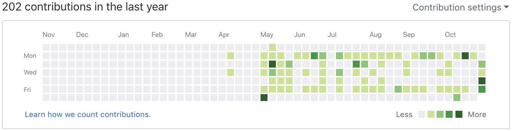
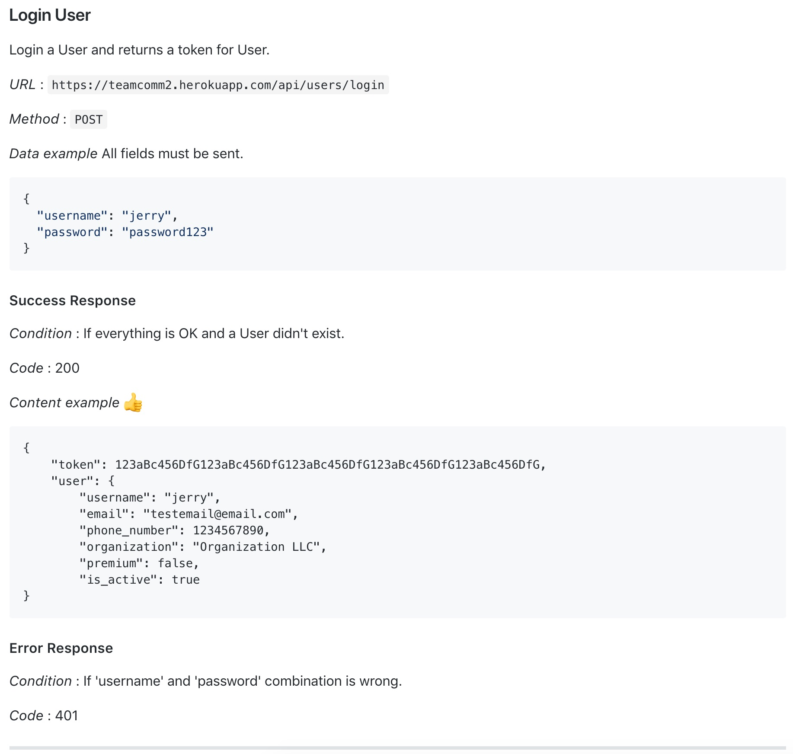
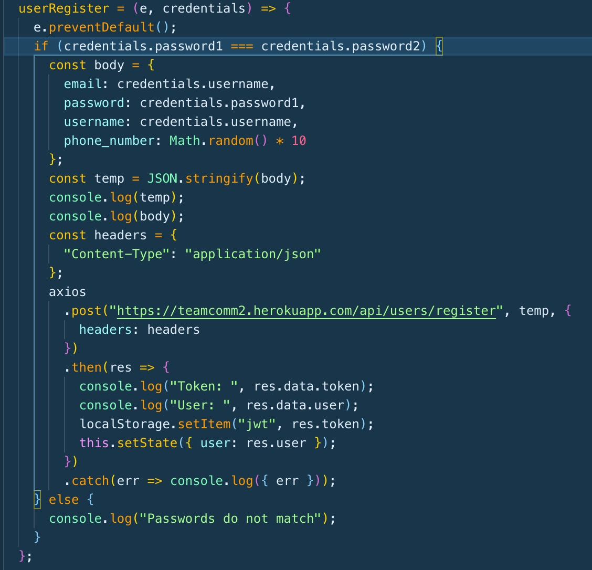
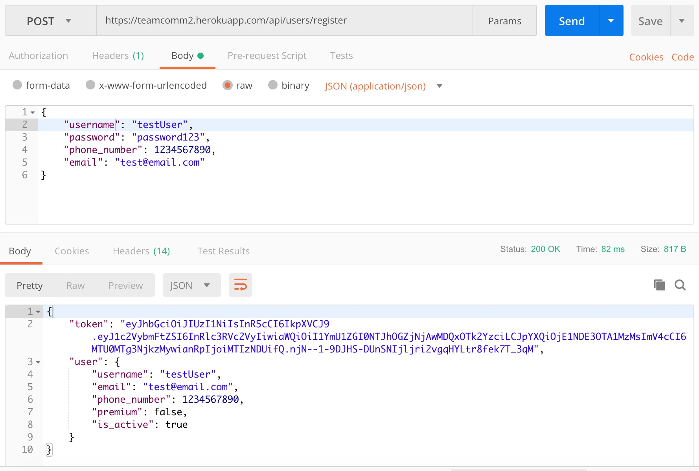
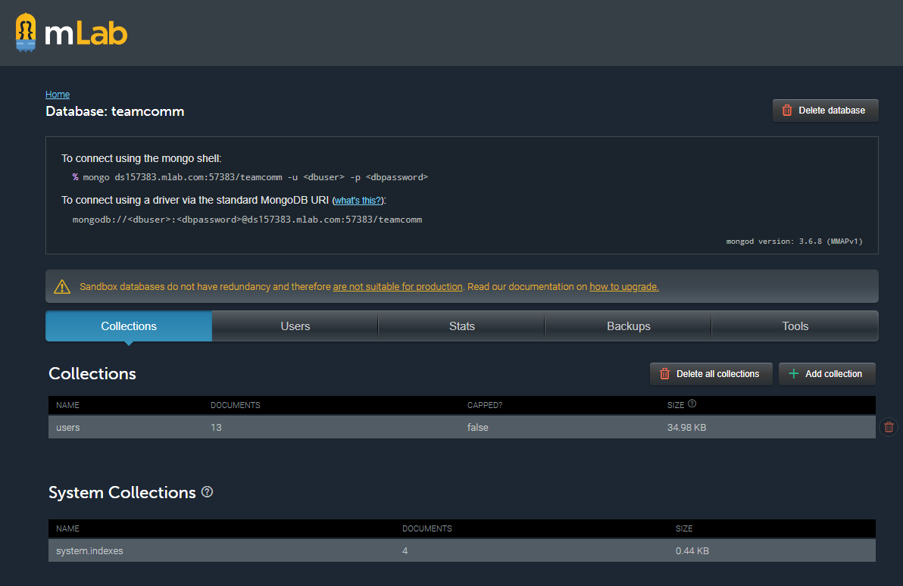
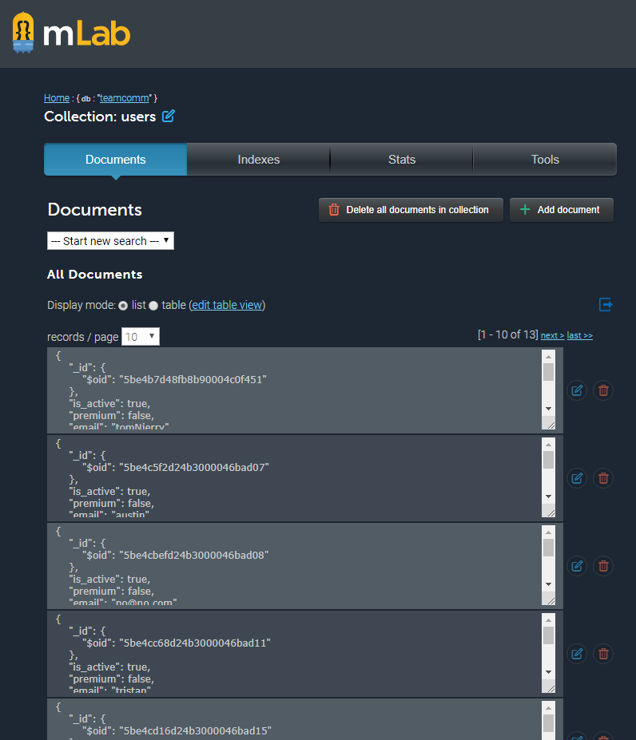

## Summary
This was our first week in Lambda Labs. I have been looking forward to this for a long time and let me tell you it was nothing like I imagined. It was full of time spent researching, studying, learning, and discussing to decide how best to buid this project. No coding at all. But let me tell you this was the best decision we made. Making sure we had looked into many tech stack options an deciding which would work best for this specific project was vital. We are now equiped with a stack that will provide us the best tools and environment to build this project.

We are fortunate enough to have some really awesome and strong developers on the team. We do all work well together and are able to manage ourselves so well. I thought about who will be on my team and what will it be like and I am incredible happy with how that turned out. Strong team and a strong project, I am excited for what we will be building.

# Part 1 - Individual Accomplishments this Week
Github Handle: Jameson13B

## Tasks Pulled

### Front End
* Ticket 1 - Cleaned up react-app boilerplate & added CSS reset
  * [Github](https://github.com/Lambda-School-Labs/Labs8-TeamComms/pull/1)
  * [Trello](https://trello.com/c/FZy5oINY)
* Ticket 2 - Register user function
  * [Github](https://github.com/Lambda-School-Labs/Labs8-TeamComms/pull/14)
  * [Trello](https://trello.com/c/PkIsY6IH)

### Back End
* Ticket 1 - User API documentation
  * [Github](https://github.com/Lambda-School-Labs/Labs8-TeamComms/pull/12)
  * [Trello](https://trello.com/c/e57NZYFx)
* Ticket 2 - Fixed and updated README
  * [Github](https://github.com/Lambda-School-Labs/Labs8-TeamComms/pull/15)
  * [Trello](https://trello.com/c/8wSlt57F)

## Detailed Analysis
I am going to focus on two of my tickets since they are similar. Register user function from the front end and User API documentation from the backend.

Even though it was not a separate ticket of mine I was able to work with Austin on building the server endpoints for the user CRUD routes. Once we were able to get those working successfully I was able to create the documentation on the README to cover all the endpoints in detail. It was fun looking at each endpoint we created and seeing what is important for others to know and how to organize the data. I have included an example screenshot so you can see how the documenation looks.

When I finished with the documentation I jumped into the front end and connected it with our server by creating a function that makes a call to the server. Having known how the server and endpoints work before starting this function really helped in a quick and clean implementation. Taking time to look and plan instead of jumping straight into coding can be a huge benefit. I have included a screenshot of the function. It still has the console logs and could need minor changes but the majority of functionality is there and works.

# Part 2 - Milestone Reflections
As I talked about above the experience of working on a team was not only different but even better then I had anticipated. It was fun getting to know my teammates more and then jump right into working. We all are very strong developers and great with time and planning. During our planning/research phase we would split the work load and learn as much as we can then report back together and discuss our findings and decide which way to go. The discussions were respectful, progressive, and professional. At first I was quite nervous but after talking with the team and pushing nerves to the side, I was able to start making progress and add some beneficial contributions.

## Front End Deployed:
https://team-comm.netlify.com/

## Back End Deployed:
https://teamcomm2.herokuapp.com

## User Accounts Created:

## User Accounts DB:

