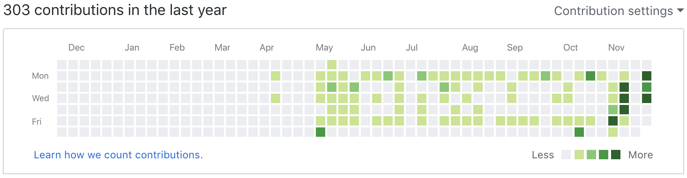
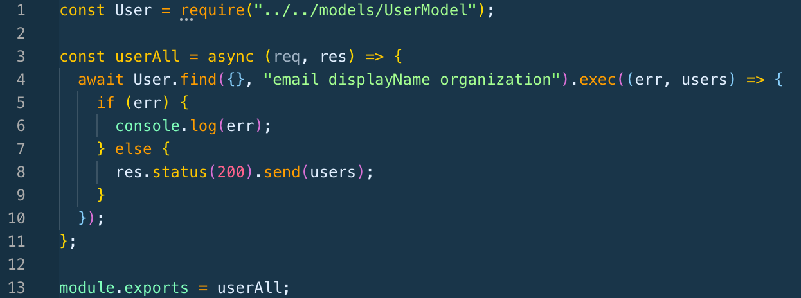
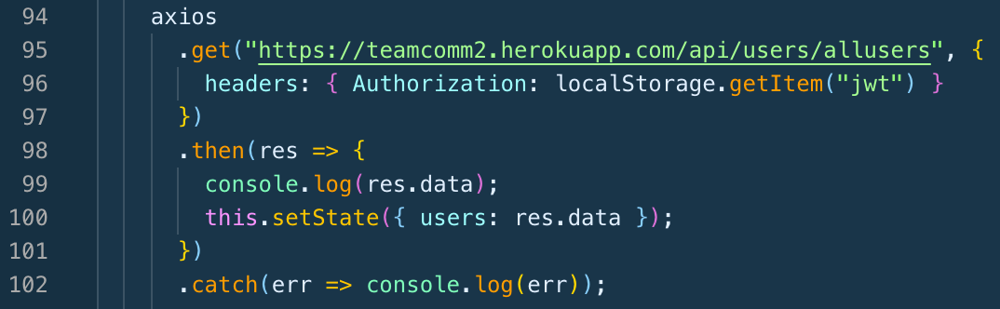
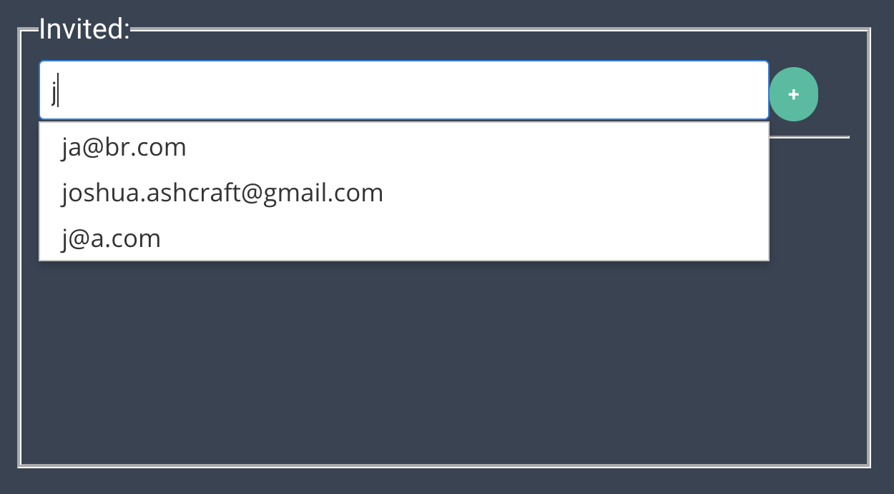

## Summary
The actual 3rd week was Thanksgiving week so we were fortunate enough to get that week off. It was a nice break with friends and family but great to be back. This week our goal was to be feature complete. Have all features working, bugs expected, and styling is not done either. Fortunately with hard work, time, and a lot of struggling with websockets we hit our goal. This week the days seemed longer and even the week as a whole seemed longer. I like to say that just allowed me more time to get stuff done.

We talked about this as a team again this week but we seriously have one of the best teams. Full of knowledge, amazing ideas, respect, and honesty. I am fortunate to have my first team experience be such a great one and helps me know how to be the best teammate I can moving forward.

# Part 1 - Individual Accomplishments this Week
Github Handle: Jameson13B

## Tasks Pulled

### Front End
* Ticket 1 - User Preference Functionality
  * [Github](https://github.com/Lambda-School-Labs/Labs8-TeamComms/pull/48)
  * [Trello](https://trello.com/c/LJp9HgUP)
* Ticket 2 - Create Meeting
  * [Github](https://github.com/Lambda-School-Labs/Labs8-TeamComms/pull/53)
  * [Trello](https://trello.com/c/opIBwlgb)
* Ticket 3 - PrimeReact Preferences CreateMeeting
  * [Github](https://github.com/Lambda-School-Labs/Labs8-TeamComms/pull/56)
  * [Trello](https://trello.com/c/xvPGy0tx)
* Ticket 4 - PrimeReact Login Register
  * [Github](https://github.com/Lambda-School-Labs/Labs8-TeamComms/pull/61)
  * [Trello](https://trello.com/c/kuecJvXF)
* Ticket 5 - Create Conversation Function
  * [Github](https://github.com/Lambda-School-Labs/Labs8-TeamComms/pull/63)
  * [Trello](https://trello.com/c/c3TE0iVk)
* Ticket 6 - Create Meeting Issues
  * [Github](https://github.com/Lambda-School-Labs/Labs8-TeamComms/pull/64)
  * [Trello](https://trello.com/c/0JrL7icD)
* Ticket 7 - Dashboard GET Meetings
  * [Github](https://github.com/Lambda-School-Labs/Labs8-TeamComms/pull/68)
  * [Trello](https://trello.com/c/bNc5y03K)

### Back End
* Ticket 1 - All Users GET Endpoint
  * [Github](https://github.com/Lambda-School-Labs/Labs8-TeamComms/pull/58)
  * [Trello](https://trello.com/c/sYdTrvKv)

## Detailed Analysis
The ticket I want to talk about a little more is my backend ticket - *All Users GET Endpoint*. This is an endpoint that returns all users from our users database. The reason this endpoint is needed is when a user is creating or editing a meeting, the invite attendees field has a fuzzy search of all users in an array. So I started by creating the actual endpoint which is pictured below.

> Server side code for endpoint
> 

We start by using the `User.find()` function to find all our users. We also specify we only want email, displayName, and organization to actually be sent. WE then check if there was an error or if it was sucessful. If there is no error the array of users is sent back to client with a status code of 200.

> Client side code
> 

Now on the client we can great our axios GET call to our new endpoint, with the json web token sent in the headers for authorization. If the request is a success we set the users array in local state to the response data from the client.

> Example of what this looks like in browser
> 

# Part 2 - Milestone Reflections
This week was very fun but also stressful and a ton of work. We have many components built that worked with our server, but now we have to start integrating them into one product. This involved a ton of team work and working together to make sure things were lining up correctly. Especially since we are using redux and have three databases and four team members, there is a lot going on so organization and communication was important this week.

It went really smooth since we were prepared and ready. The only thing we didn't finish is the route/redirects from page to page. Some pages have them but some do not. Besides that its working quite well and wont take much more time to implement that.

## Features Have Been Implemented:
If you visit this link, features(listed below) are functioning and site can be used. Missing some route/redirect links so you may have to manually type them into the URL for now(will not below).
https://team-comm.netlify.com/

## Features:
- Register/Login/Logout
- Dashboard - displays all meetings user created or is invited to
- Create Meeting(`/createMeeting`) - form to create a new meeting
- Update Meeting(`/updateMeeting/:id`) - form to update meeting details
- User Preferences(`/preferences`) - form to update user details, reminder preferences, change password, and more
- Stripe Upgrade - button that when clicked lets a user upgrade to premium account through Stripe integration

## [Whiteboard #2 Video - Min Jumps](https://youtu.be/YuYZ475fL04)