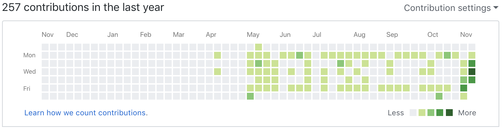
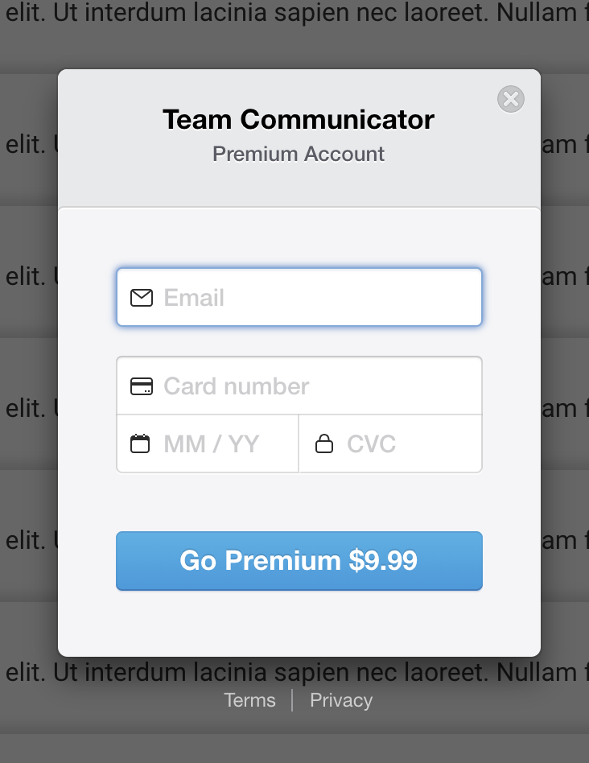
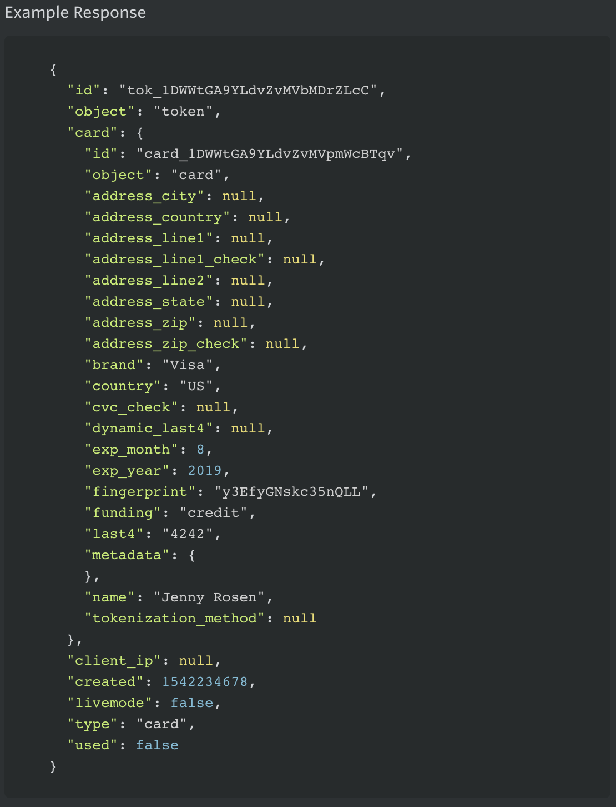
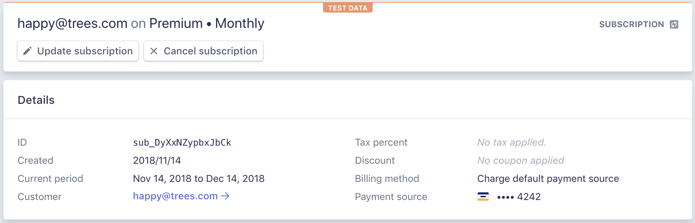

## Summary
As week two started I was feeling good. We had an awesome first week and parts of our project were really starting to come together. We had Monday off due to the holiday, but we all worked a partial day this day. This week we were focused on our APIs and authentication with OAuth. We choose Google for our OAuth. Since we had so much to accomplish in regards to all our APIs and the OAuth we decided to divide and conquer.

I took on the Stripe API which we will be using for the billing of our premium membership. The specific features this membership will come with are still undecided at this time. But it was fun to research the API, how it works and then get it integrated with our specific project. It was really nice having our team to help us out. Many times we would run into little issues and we would get together and show the issues and discuss how it is supposed to work. Typically this would lead to us figuring it out as a team. I am super fortunate to be on such an amazing team on this project.

# Part 1 - Individual Accomplishments this Week
Github Handle: Jameson13B

## Tasks Pulled

### Front End
* Ticket 1 - Created the basic Conversation List component that will display the conversations
  * [Github](https://github.com/Lambda-School-Labs/Labs8-TeamComms/pull/18)
  * [Trello](https://trello.com/c/21pJT4a3)
* Ticket 2 - Refactor register form component
  * [Github](https://github.com/Lambda-School-Labs/Labs8-TeamComms/pull/23)
  * [Trello](https://trello.com/c/pssnhnb9)
* Ticket 3 - Refactor login form component
  * [Github](https://github.com/Lambda-School-Labs/Labs8-TeamComms/pull/24)
  * [Trello](https://trello.com/c/DAY8B5Wh)
* Ticket 4 - Created the basic Create Conversation component
  * [Github](https://github.com/Lambda-School-Labs/Labs8-TeamComms/pull/42)
  * [Trello](https://trello.com/c/q9UvcKNl)
* Ticket 5 - Created the basic User Preferences component
  * [Github](https://github.com/Lambda-School-Labs/Labs8-TeamComms/pull/44)
  * [Trello](https://trello.com/c/UK7naWzP)
* Ticket 6 - Billing stripe integration on front end
  * [Github](https://github.com/Lambda-School-Labs/Labs8-TeamComms/pull/30)
  * [Trello](https://trello.com/c/5EBUfGV9)

### Back End
* Ticket 1 - Billing stripe integration on back end
  * [Github](https://github.com/Lambda-School-Labs/Labs8-TeamComms/pull/39)
  * [Trello](https://trello.com/c/KCy3WV26)

## Detailed Analysis
The ticket I am detailing this week is going to be a dual ticket again. Stripe integration which happened to required code on the front end and the back end. The front end consisted of setting up the checkout modal in a react component which I have included a screenshot below. It had a handful of customizions as you can see. Everything from the fields it prompts for, the header and descriptions, and the button. The best part about creating this as a React component is the "Go Premium" button can be placed in multiple spots anywhere on the application and it will simply trigger the Stripe modal.

> Front end pop up modal
> 

When the checkout is complete a token object is created. I have included an example of the token object below. This object has details about the transaction but only limited info(type of card, last 4, email, etc.) and also has a token ID. This token object must be sent to our server.

> Stripe token example
> 

Now on the backend we need to have an endpoint where we are able to receive the token object. This step is actually quite simple. We need to look into our user database and find the user who just upgraded. We then using the Stripe API create a customer and subscribe them to a billing plan which we create on the Stripe dashboard. After thats done all that is left is updating the users stripeID and premium status to true.

# Part 2 - Milestone Reflections
This week was a fun week for me. I am a big fan of APIs and implementing them into projects. Its really cool to be able to work with tools that other developers have created. Having them sync together and start communicating is a really good feeling. As with all new libraries and APIs there is a learning hurdle and it was nice to have our team to help each other out. We all specialized and focused on one API but still helped each other enough and showed each other our work so we learned a bit about all the APIs we are using. To cover some of the APIs we have integrated so far:
- Stripe API
- Socket.io
- Passport/Google OAuth
- Our own user API
- Our own conversation API **next weeks task*
- Zoom API **next weeks tasks*

A pretty good list and most are already done. Making great progress and feeling great so far. Excited to keep making progress and deliver an awesome product.

## Front and Back End Connected:
If you visit this link, you can register/login and upgrade via stripe which all require front and back to be connected.
https://team-comm.netlify.com/

## Users can login through the front end via OAuth:
The link below has a Google OAuth login button.
https://team-comm.netlify.com/login

## APIs are connected and can be interacted with through the front end:
Our hosted front end and hosted backend was used to upgrade a premium user. This is the Stripe dashboard confirmation.

## [Whiteboard #1 Video - Nth Fibonacci](https://youtu.be/icy1YazAHEY)